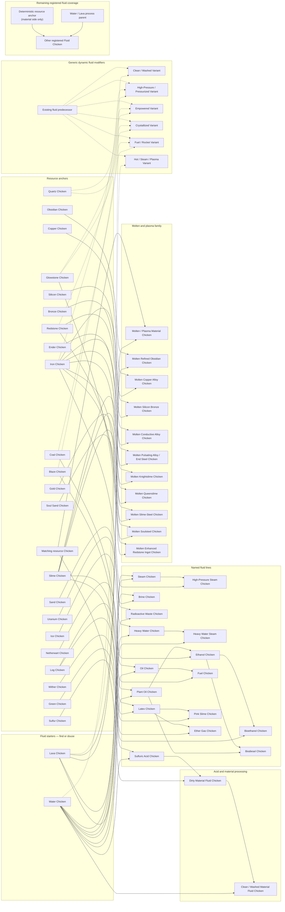

```mermaid
flowchart LR
    %% Fluid roots
    subgraph roots["Fluid starters — find or douse"]
        water["Water Chicken"]
        lava["Lava Chicken"]
    end

    %% Resource parents
    subgraph anchors["Resource anchors"]
        iron["Iron Chicken"]
        copper["Copper Chicken"]
        gold["Gold Chicken"]
        obsidian["Obsidian Chicken"]
        coal["Coal Chicken"]
        log["Log Chicken"]
        sulfur["Sulfur Chicken"]
        netherwart["Netherwart Chicken"]
        green["Green Chicken"]
        slime["Slime Chicken"]
        blaze["Blaze Chicken"]
        glowstone["Glowstone Chicken"]
        quartz["Quartz Chicken"]
        ender["Ender Chicken"]
        soulsand["Soul Sand Chicken"]
        sand["Sand Chicken"]
        ice["Ice Chicken"]
        wither["Wither Chicken"]
        uranium["Uranium Chicken"]
        silicon["Silicon Chicken"]
        bronze["Bronze Chicken"]
        redstone["Redstone Chicken"]
        material["Matching resource Chicken"]
    end

    %% Named and authored fluid lines
    subgraph named["Named fluid lines"]
        steam["Steam Chicken"]
        highPressureSteam["High-Pressure Steam Chicken"]
        heavyWater["Heavy Water Chicken"]
        heavyWaterSteam["Heavy Water Steam Chicken"]
        brine["Brine Chicken"]
        radioactiveWaste["Radioactive Waste Chicken"]
        sulfuricAcid["Sulfuric Acid Chicken"]
        oil["Oil Chicken"]
        plantOil["Plant Oil Chicken"]
        ethanol["Ethanol Chicken"]
        bioethanol["Bioethanol Chicken"]
        biodiesel["Biodiesel Chicken"]
        fuel["Fuel Chicken"]
        latex["Latex Chicken"]
        pinkSlime["Pink Slime Chicken"]
        etherGas["Ether Gas Chicken"]
    end

    water --> steam
    lava --> steam

    steam --> highPressureSteam
    iron --> highPressureSteam

    ice --> heavyWater
    water --> heavyWater
    heavyWater --> heavyWaterSteam
    lava --> heavyWaterSteam

    water --> brine
    sand --> brine

    uranium --> radioactiveWaste
    water --> radioactiveWaste

    sulfur --> sulfuricAcid
    water --> sulfuricAcid

    coal --> oil
    water --> oil

    log --> plantOil
    water --> plantOil

    plantOil --> ethanol
    netherwart --> ethanol

    ethanol --> bioethanol
    green --> bioethanol

    ethanol --> biodiesel
    plantOil --> biodiesel

    oil --> fuel
    blaze --> fuel

    slime --> latex
    log --> latex

    latex --> pinkSlime
    slime --> pinkSlime

    latex --> etherGas
    wither --> etherGas

    %% Molten and plasma materials
    subgraph molten["Molten and plasma family"]
        moltenMaterial["Molten / Plasma Material Chicken"]
        moltenRefinedObsidian["Molten Refined Obsidian Chicken"]
        copperAlloy["Molten Copper Alloy Chicken"]
        siliconBronze["Molten Silicon Bronze Chicken"]
        conductiveAlloy["Molten Conductive Alloy Chicken"]
        endAlloys["Molten Pulsating Alloy / End Steel Chicken"]
        knightSlime["Molten Knightslime Chicken"]
        queenSlime["Molten Queenslime Chicken"]
        slimeSteel["Molten Slime-Steel Chicken"]
        soulSteel["Molten Soulsteel Chicken"]
        enhancedRedstone["Molten Enhanced Redstone Ingot Chicken"]
    end

    material --> moltenMaterial
    lava --> moltenMaterial

    obsidian --> moltenRefinedObsidian
    lava --> moltenRefinedObsidian

    copper --> copperAlloy
    iron --> copperAlloy

    silicon --> siliconBronze
    bronze --> siliconBronze

    redstone --> conductiveAlloy
    iron --> conductiveAlloy

    ender --> endAlloys
    iron --> endAlloys

    slime --> knightSlime
    iron --> knightSlime

    slime --> queenSlime
    gold --> queenSlime

    slime --> slimeSteel
    iron --> slimeSteel

    soulsand --> soulSteel
    iron --> soulSteel

    redstone --> enhancedRedstone
    glowstone --> enhancedRedstone

    %% Acid and material processing
    subgraph processing["Acid and material processing"]
        dirtyMaterial["Dirty Material Fluid Chicken"]
        cleanMaterial["Clean / Washed Material Fluid Chicken"]
    end

    sulfuricAcid --> dirtyMaterial
    material --> dirtyMaterial
    dirtyMaterial --> cleanMaterial
    water --> cleanMaterial

    %% Generic dynamic modifier families
    subgraph modifiers["Generic dynamic fluid modifiers"]
        predecessor["Existing fluid predecessor"]
        washed["Clean / Washed Variant"]
        pressurized["High-Pressure / Pressurized Variant"]
        empowered["Empowered Variant"]
        crystallized["Crystallized Variant"]
        fuelVariant["Fuel / Rocket Variant"]
        hotVariant["Hot / Steam / Plasma Variant"]
    end

    predecessor -.-> washed
    water -.-> washed

    predecessor -.-> pressurized
    iron -.-> pressurized
    quartz -.-> pressurized

    predecessor -.-> empowered
    glowstone -.-> empowered
    redstone -.-> empowered

    predecessor -.-> crystallized
    quartz -.-> crystallized
    glowstone -.-> crystallized

    predecessor -.-> fuelVariant
    blaze -.-> fuelVariant
    coal -.-> fuelVariant

    predecessor -.-> hotVariant
    lava -.-> hotVariant

    %% Deterministic coverage for remaining registered fluids
    subgraph fallback["Remaining registered fluid coverage"]
        resourceFallback["Deterministic resource anchor\n(material side only)"]
        processFallback["Water / Lava process parent"]
        otherFluid["Other registered Fluid Chicken"]
    end

    resourceFallback --> otherFluid
    processFallback --> otherFluid
```